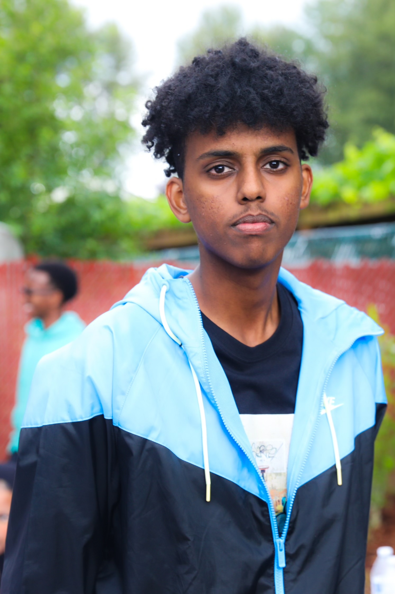

  

# eliabalula.github.io
Portfolio and selected projects by Eliab Alula

# About me
Hello, I’m currently a Computer Science student at SPU with a strong interest in problem-solving and software development. I originally became interested in programming because I liked the idea of combining creativity with logic to build things from the ground up. At first, learning to code was challenging, but over time, everything started to make more sense, and I began to really enjoy the process. Seeing my progress through projects and overcoming difficult problems motivated me to keep improving my skills and continue expanding my knowledge as a developer.

I usually spend time coding in the evenings since I tend to have more free time during those hours, which gives me a good opportunity to focus on more challenging problems and assignments. Whether I’m working on class projects or practicing on my own, I try to stay consistent with learning because I know programming is a skill that improves through continuous practice. Most of my experience so far has been with C++, where I’ve built a strong foundation in programming concepts. I also have some slight experience with Python and Java, and am currently continuing to expand my knowledge in both languages. In the future, I hope to continue improving my skills and gaining experience in different areas of software development.

[View my CS courses](courses.md)

[View my Goals for 2026](goals.md)
